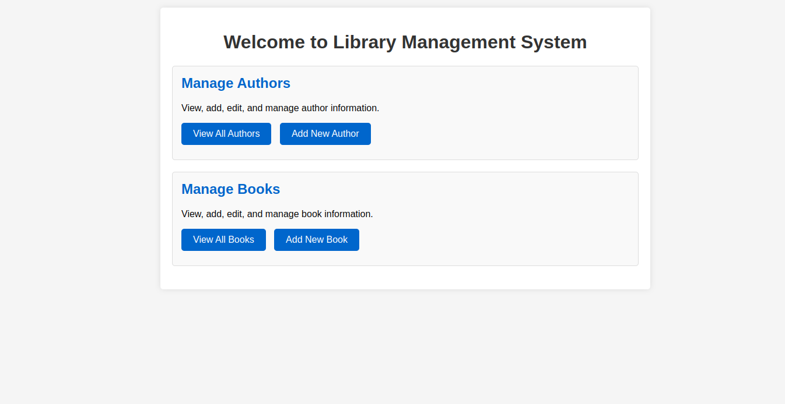
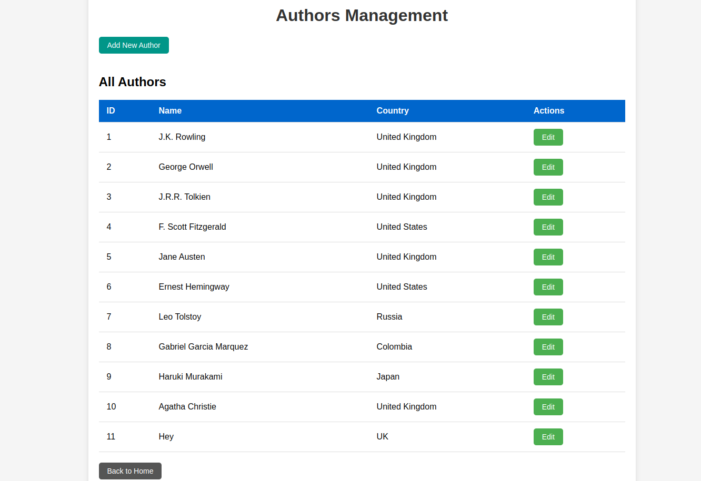
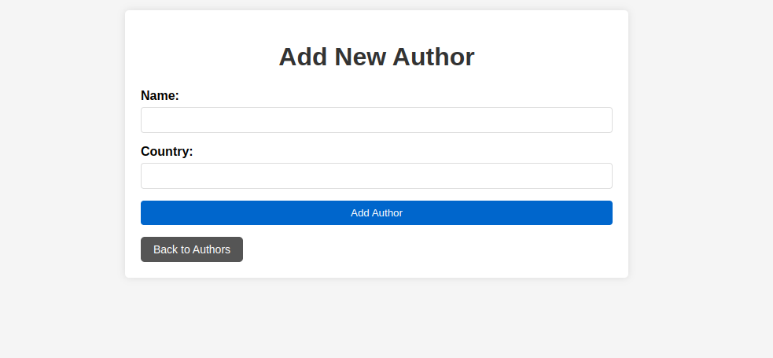
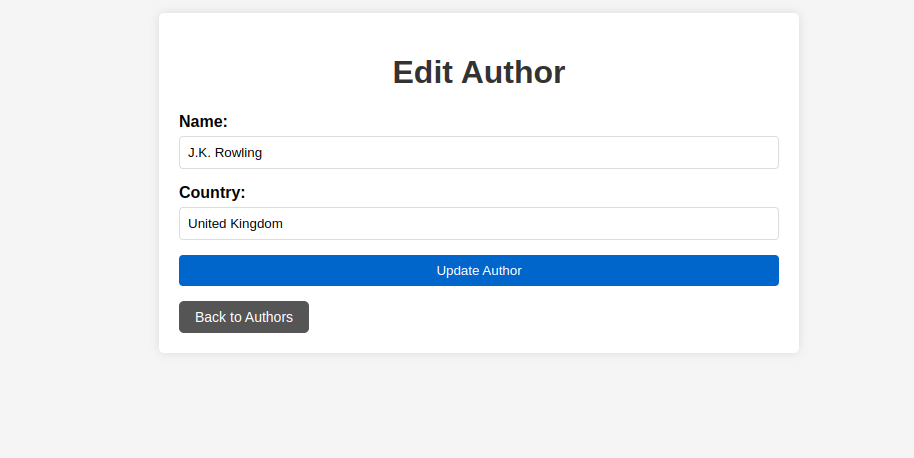
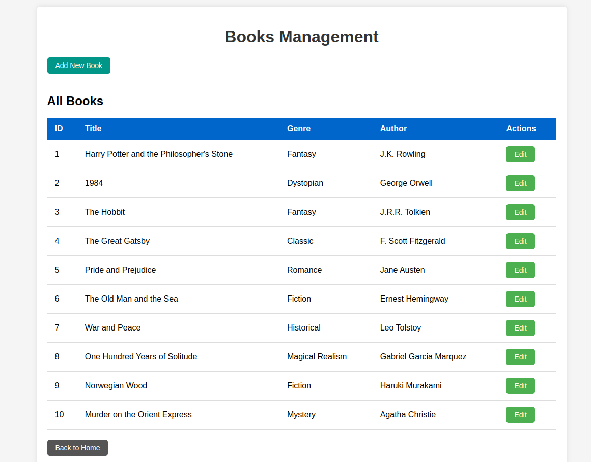
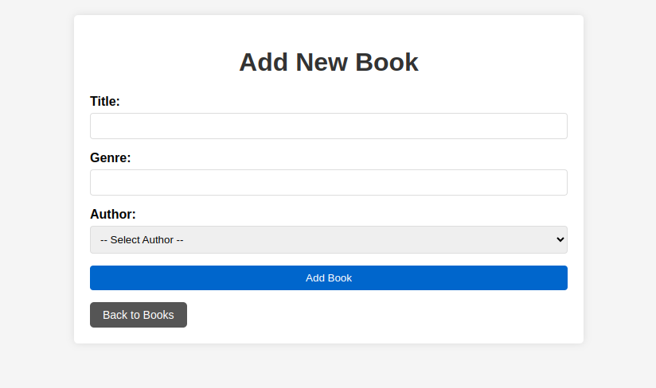
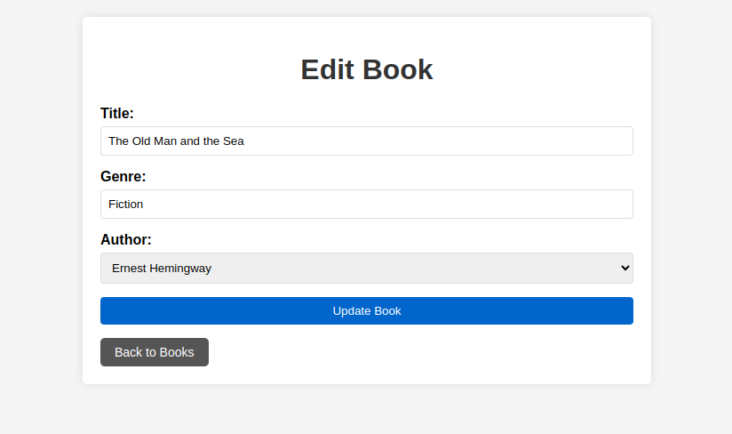

# Library Management System

A Spring Boot application to manage information for Books and Authors with create, read, and update operations.

## Entity Relationship Design

The application manages two entities with the following relationship:

### Author Entity

- `id`: Long (Primary Key)
- `name`: String
- `country`: String
- Relationship: One-to-Many with Book

### Book Entity

- `id`: Long (Primary Key)
- `title`: String
- `genre`: String
- `author`: Many-to-One reference to Author

Each author can be associated with multiple books, and each book is linked to a single author. The relationship is implemented using JPA annotations like `@OneToMany` and `@ManyToOne`.

## Features Implemented

### 1. Database Population

- Created required tables using JPA annotations
- Populated both Book and Author tables with 10 sample entries each via a DataInitializer component

### 2. Create Operation

- Implemented forms in JSP pages to add new authors and books
- Created controller methods to handle form submissions
- Implemented exception handling for integrity violations

### 3. Read Operation

- Implemented views to display lists of authors and books
- Created controller methods that fetch data via the service layer
- Implemented custom query in the repository layer for joining books with authors

### 4. Update Operation

- Implemented functionality to edit existing authors and books
- Created controller methods to handle update requests
- Displayed pre-filled forms with existing data for editing

## Technologies Used

- Spring Boot 2.7.18
- Spring Data JPA
- JSP and JSTL for views
- MySQL database
- JUnit and Mockito for testing

## Project Structure

- **Entity Layer**: Defines data models with JPA annotations
- **Repository Layer**: Provides data access with custom queries
- **Service Layer**: Contains business logic
- **Controller Layer**: Handles HTTP requests and responses
- **View Layer**: JSP pages with JSTL for data rendering
- **Test Layer**: Unit tests for repositories and services

## How to Run

1. Clone the repository
2. Configure MySQL database in `application.properties` (update username/password if needed)
3. Run the application with Maven:
   ```
   mvn spring-boot:run
   ```
4. Access the application at `http://localhost:8080`

## Screenshots

### Home Page


The home page serves as the central navigation hub for the Library Management System. From here, users can access the two main sections of the application: Author Management and Book Management. Each card provides a brief description of what can be done in that section, with buttons to view all entries or add new ones directly.

### Authors Listing


The Authors Listing page displays all authors stored in the database in a tabular format. Each row shows an author's ID, name, country, and provides an Edit button to modify the author's information. The green "Add New Author" button at the top allows users to create new author entries. This list is populated initially with 10 sample authors from the DataInitializer.

### Add/Edit Author Form


The Add Author form provides fields to enter a new author's name and country. The form uses validation to ensure all required fields are completed before submission.



The Edit Author form pre-fills the current author's information, allowing users to modify the name and country. This demonstrates the update functionality of the application.

### Books Listing


The Books Listing page shows all books in the library with their ID, title, genre, and associated author's name. This demonstrates the entity relationship between Books and Authors, showing how we retrieve and display related data. The table is populated with 10 sample books from the DataInitializer, each connected to one of the sample authors.

### Add/Edit Book Form


The Add Book form includes fields for title and genre, plus a dropdown menu to select an existing author. This demonstrates how we implement the many-to-one relationship between Books and Authors in the user interface.



The Edit Book form pre-fills the current book's information and allows the user to change the title, genre, and associated author. The dropdown menu shows all available authors and pre-selects the book's current author.

## Tests

The application includes unit tests for:

- Repository methods including custom join query
- Service layer business logic

Run tests with:

```
mvn test
```

## Challenges and Solutions

### Challenge: Mapping Entity Relationships

**Solution**: Used proper JPA annotations (`@OneToMany`, `@ManyToOne`) with appropriate cascade types.

### Challenge: Handling Form Data

**Solution**: Created proper model attributes for binding form data to entities and implemented validation.

### Challenge: Creating Efficient Joins

**Solution**: Implemented custom repository method with JPQL query using JOIN FETCH to avoid N+1 query issues.

### Challenge: Pre-filling Update Forms

**Solution**: Retrieved entity by ID and bound it to the form model attribute for seamless editing experience.
